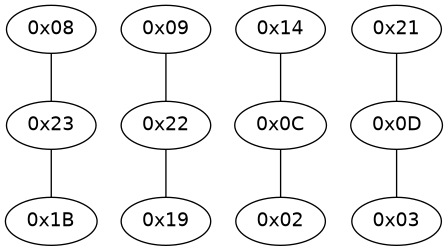

# AppleALC path visualization

Visualization tool for AppleALC "Platform*.xml" files.

## Dependencies

 * [Ruby](https://www.ruby-lang.org)
 * [Graphviz](https://graphviz.org/)
 * `plist` [gem](https://rubygems.org/gems/plist/versions/3.2.0)
 * `ruby-graphviz` [gem](https://rubygems.org/gems/ruby-graphviz)
